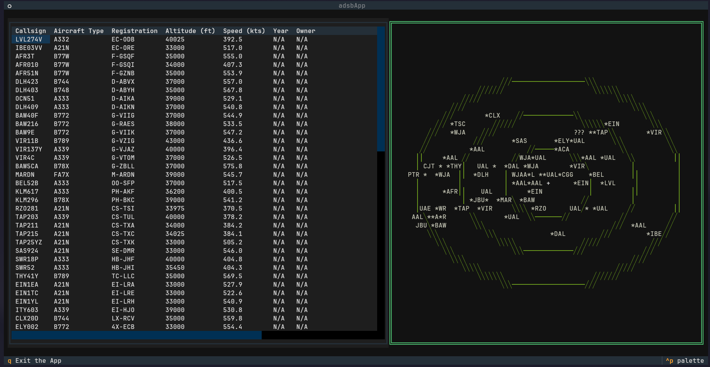

# ADSB-TUI



## What is it?

Adsb-tui is a terminal user interface that gives you aircraft information of all aircraft flying with a 250 mile radius. The Program is made in python using textual and api's from adsb.lol, adsb.fi, airplanes.live and ip-api.com. The project was made as a exercise to get rid of some rust in my programming skills. The thought behind choosing this was I needed something that I would use to finish the project. 

## Features

ADSB-TUI has Callsign, Aircraft Type, Registration, Altitude, Speed, Year the aircraft was built and Owner columns. There is also colour indication for military aircraft (green) and aircraft with emergencies (red). On the right hand side there is a radar with all of the aircraft in respect to your own location which is located when you first start the application.

## Project Structure

```
├── displayEngine.py
├── radarCanvas.py
├── dataFilter.py
├── dataMerger.py
├── dataCollector.py
├── ipLocation.py
└── style.tcss
```

#### `displayEngine.py`

- Entry point to the application. Houses the UI and timer for the collection of data.

#### `radarCanvas.py`

- Makes and displays all of the aircraft on a radar screen with respect to your location.

#### `dataCollector.py`

- Handles the network layer, fetching raw JSON data from the API endpoints.

#### `dataMerger.py`

- Merges data from the three adsb api's with pandas to have one complete database. 

#### `dataFilter.py`

- Filters the data collected from the database and packages it for the UI.

#### `ipLocation.py`

- Automatically geolocates your machine on the start of the application to dynamically set the coordinates of the radar. 

#### `style.tcss`

- The styling for the textual program. 

## How To Use

### Prereqs

Must be using Python 3.10+.

### Setup

``` git clone https://github.com/JackEllison4/ADSB-tui.git
cd ADSB-tui
python3 -m venv .venv
source .venv/bin/activate
pip install textual requests pandas
```

### Run

``` 
source .venv/bin/activate
python3 displayEngine.py 
```

## Keybinds

| Key | Action |
| :--- | :--- |
| `q` | Exit the application safely |
| `Up` / `Down` | Scroll through the aircraft list |

## Future Changes

At somepoint in the future I plan on hosting this via SSH but apart from that this project is done.

## License

This project is open-source and licensed under the GNU General Public License v3 (GPLv3). See the `LICENSE` file for more details.
